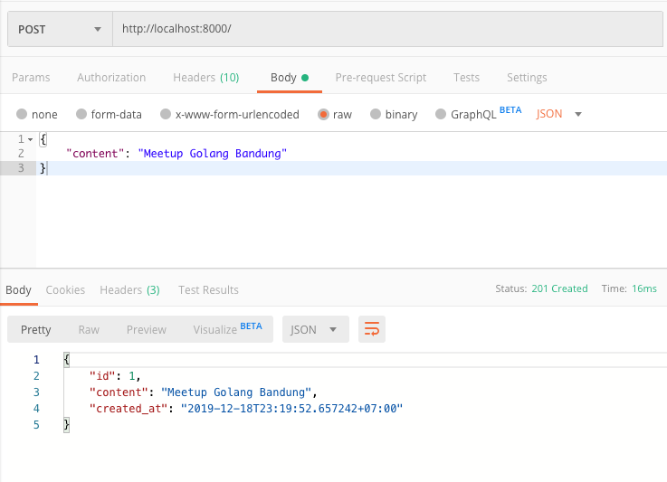
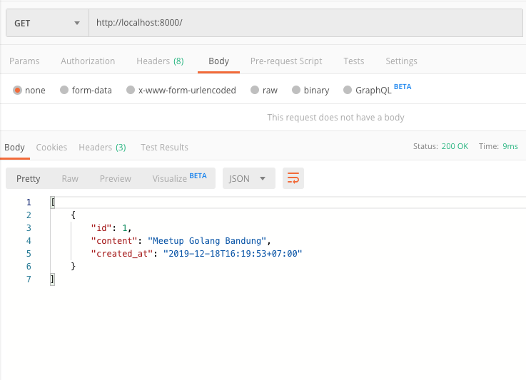

## Contoh

---

### Notes API Backend

- API Sederhana yang berfungsi untuk membuat dan menampilkan catatan.
- Menggunakan MySQL untuk menyimpan data.
- Hanya akan menggunakan library bawaan golang.

---

### Packages

```javascript
import (
	"database/sql"
	"log"
	"net/http"
	"time"
	"encoding/json"

	_ "github.com/go-sql-driver/mysql"
)
```

- `net/http` adalah package untuk server dan client http.
- `database/sql` adalah package abstraksi perintah ke sql database.
- `github.com/go-sql-driver/mysql` adalah package untuk driver mysql yang akan digunakan oleh package `database/sql`.
- `encoding/json` adalah package yang digunakan untuk mengkonversi nilai golang kedalam bentuk json dan sebaliknya.

---

### Model dan Controller

```javascript
type Note struct {
	ID        int64     `json:"id"`
	Content   string    `json:"content"`
	CreatedAt time.Time `json:"created_at"`
}

type NoteController struct {
	DB *sql.DB
}

```

- Stuct `Note` berfungsi untuk menampung data yang akan di proses controller.
- `NoteController` menyimpan dependensi yang dibutuhkan oleh controller tersbut, yaitu `DB`.

---

### Menampilkan Seluruh Catatan

```javascript
func (nc NoteController) List(w http.ResponseWriter, req *http.Request) {
	// 1. Query ke database.
	rows, err := nc.DB.Query("SELECT id, content, created_at FROM notes")
	if err != nil {
		http.Error(w, err.Error(), 500)
		return
	}
	defer rows.Close() // Pastikan row ditutup setelah fungsi selesai.

	// 2. Baca hasil query database.
	notes := make([]Note, 0)
	for rows.Next() {
		var note Note
		err := rows.Scan(&note.ID, &note.Content, &note.CreatedAt)
		if err != nil {
			http.Error(w, err.Error(), 500)
			return
		}

		notes = append(notes, note)
	}

	// 3. Kirim response balikan.
	w.Header().Set("Content-Type", "application/json")
	w.WriteHeader(http.StatusOK)
	json.NewEncoder(w).Encode(notes)
}
```

---

### Menyimpan Catatan Baru

```javascript
func (nc NoteController) Create(w http.ResponseWriter, req *http.Request) {
	var note Note
	// 1. Parse json yang dikirimkan melalui request.
	if err := json.NewDecoder(req.Body).Decode(&note); err != nil {
		http.Error(w, err.Error(), 400)
	}

	// 2, Update tanggal pembuatan note.
	note.CreatedAt = time.Now()

	// 3. Simpan ke Database.
	result, err := nc.DB.Exec("INSERT INTO notes (content, created_at) VALUES (?, ?)", note.Content, note.CreatedAt)
	if err != nil {
		http.Error(w, err.Error(), 500)
		return
	}

	// 4. Ambil Primary ID hasil insert sebelunmnya.
	note.ID, err = result.LastInsertId()
	if err != nil {
		http.Error(w, err.Error(), 500)
		return
	}

	// 5. Kirim response balikan.
	w.Header().Set("Content-Type", "application/json")
	w.WriteHeader(http.StatusCreated)
	json.NewEncoder(w).Encode(note)
}
```

---

### Inisialisasi dan Menjalankan Server

```javascript
func main() {
	// 1. Buka koneksi ke database mysql.
	db, err := sql.Open("mysql", "root@tcp(localhost:3306)/notes?parseTime=True&loc=Local")
	if err != nil {
		log.Fatal(err)
	}
	defer db.Close()

	// 2. Buat Controller baru untuk Note, dan sertakan dependensinya.
	noteController := NoteController{DB: db}

	// 3. Setup routing untuk endpoint http.
	mux := http.NewServeMux()
	mux.HandleFunc("/", func(w http.ResponseWriter, req *http.Request) {
		if req.URL.Path != "/" {
			http.NotFound(w, req)
			return
		}

		switch req.Method {
		case "GET":
			noteController.List(w, req)
		case "POST":
			noteController.Create(w, req)
		default:
			http.NotFound(w, req)
		}
	})

	// 4. Jalanklan server!
	log.Fatal(http.ListenAndServe(":8000", mux))
}
```

--- 

### Hasil: Membuat Catatan Baru



---

### Hasil: Menampilkan Semua Catatan


